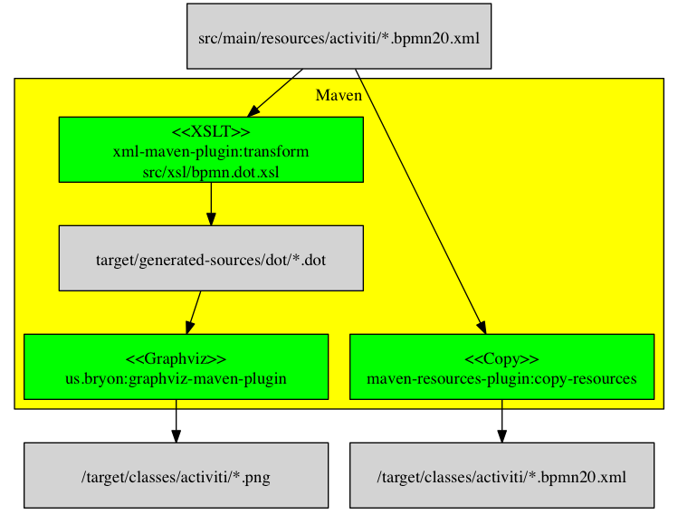
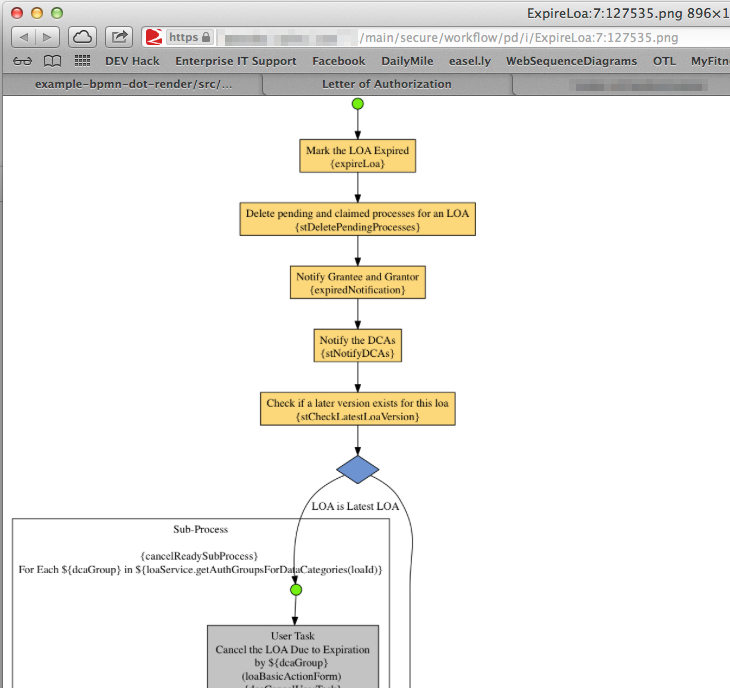

I tired fairly quickly of the BPMN toolset issues I ran into and decided that all I really needed was a nice rendering of my BPMN with a LOW barrier to entry.  To that end, I decided to use <a href="http://www.graphviz.org">Graphviz</a> to render my BPMN.  I have used <a href="http://www.graphviz.org">Graphviz</a> for years on other configuration file visualization projects as well as using it to document just about everything I can on our <a href="http://atlassian.com/software/confluence">Confluence</a> Wiki at work.

Without wasting too much more of your time, I'll outline my environment and the resource pipeline, and how we load the PNG files into the engine along with our BPMN documents themselves.

## Environment

* Java 6
* Graphviz (installed and in path)
* Maven 3
* Activiti BPMN Engine
* Jenkins ( Continuous Integratoin )

## Basic Pipeline

1. Load BPMN
2. Transform *.bpmn20.xml with bpmn.dot.xsl to *.dot
3. Compile *.dot Files to *.png files

# Instructions

## Prerequisites
I assume you have a working maven installation and at least an empty project setup.
If you do not have a project setup, you can clone [this project](http://github.com/trevershick/example-bpmn-dot-render) which has everything setup already.

## Setup your Project Folders

	/Development/workspaces/loa/example-bpmn-dot-render 
	 $ tree
	.
	├── pom.xml
	├── src
		├── main
			└── resources
				├── activiti
				│   └── TestProcess.bpmn20.xml
				└── xsl
					└── bpmn.dot.xsl

1. Add your [BPMN](https://raw.github.com/trevershick/example-bpmn-dot-render/master/src/main/resources/activiti/TestProcess.bpmn20.xml) to src/main/resources/activiti
2. Add the [fxsl](https://raw.github.com/trevershick/example-bpmn-dot-render/master/src/main/resources/xsl/bpmn.dot.xsl) to src/main/resources/xsl

## Install Graphviz
1. Install graphviz from [graphviz.org](http://www.graphviz.org)
2. Ensure graphviz is in your path by running ``dot -v``

	$ dot -v	
	dot - graphviz version 2.28.0 (20120730.1217)

## Add the XSLT Processing Plugin

Add ``xml-maven-plugin`` to the ``build > plugins`` section of your pom.xml

	<plugin>
		<groupId>org.codehaus.mojo</groupId>
		<artifactId>xml-maven-plugin</artifactId>
		<version>1.0</version>
		<executions>
			<execution>
				<phase>process-resources</phase>
				<goals>
					<goal>transform</goal>
				</goals>
			</execution>
		</executions>
		<configuration>
			<transformationSets>
				<transformationSet>
					<dir>src/main/resources/activiti</dir>
					<stylesheet>src/main/resources/xsl/bpmn.dot.xsl</stylesheet>
					<outputDir>target/generated-sources/dot</outputDir>
					<fileMappers>
						<fileMapper
							implementation="org.codehaus.plexus.components.io.filemappers.RegExpFileMapper">
							<pattern>^(.*)\.bpmn20.xml$</pattern>
							<replacement>$1.dot</replacement>
						</fileMapper>
					</fileMappers>--&gt;
				</transformationSet>
			</transformationSets>
		</configuration>
	</plugin>

## Add the Graphviz Plugin

Add ``graphviz-maven-plugin`` to the ``build > plugins`` section of your pom.xml

	<plugin>
		<groupId>us.bryon</groupId>
		<artifactId>graphviz-maven-plugin</artifactId>
		<version>1.0</version>
		<executions>
			<execution>
				<phase>process-resources</phase>
				<goals>
					<goal>dot</goal>
				</goals>
			</execution>
		</executions>
		<configuration>
			<basedir>target/generated-sources/dot</basedir>
			<destdir>target/classes/activiti</destdir>
		</configuration>
	</plugin>

## Run ``mvn compile``

	 $ mvn compile
	[INFO] Scanning for projects...
	[INFO]                                                                         
	[INFO] ------------------------------------------------------------------------
	[INFO] Building example-bpmn-dot-render 0.0.1-SNAPSHOT
	[INFO] ------------------------------------------------------------------------
	[INFO] 
	[INFO] --- maven-resources-plugin:2.5:resources (default-resources) @ example-bpmn-dot-render ---
	[debug] execute contextualize
	[WARNING] Using platform encoding (MacRoman actually) to copy filtered resources, i.e. build is platform dependent!
	[INFO] Copying 2 resources
	[INFO] 
	[INFO] --- xml-maven-plugin:1.0:transform (default) @ example-bpmn-dot-render ---
	[INFO] Transforming file: /Users/trevershick/Development/workspaces/loa/example-bpmn-dot-render/src/main/resources/activiti/TestProcess.bpmn20.xml
	[INFO] Transformed 1 file(s).
	[INFO] 
	[INFO] --- graphviz-maven-plugin:1.0:dot (default) @ example-bpmn-dot-render ---
	[INFO] 
	[INFO] --- maven-compiler-plugin:2.3.2:compile (default-compile) @ example-bpmn-dot-render ---
	[INFO] Nothing to compile - all classes are up to date
	[INFO] ------------------------------------------------------------------------
	[INFO] BUILD SUCCESS
	[INFO] ------------------------------------------------------------------------
	[INFO] Total time: 2.428s
	[INFO] Finished at: Thu Jan 31 08:13:17 EST 2013
	[INFO] Final Memory: 5M/81M
	[INFO] ------------------------------------------------------------------------

You should see BUILD SUCCESS.  If the build succeeds then you should see the *.png files in target/classes/activiti (as shown below).

	~/Development/workspaces/loa/example-bpmn-dot-render 
	 $ tree
	.
	├── LICENSE.md
	├── README.md
	├── pom.xml
	├── src
	│   ├── main
	│   │   ├── java
	│   │   └── resources
	│   │       ├── activiti
	│   │       │   └── TestProcess.bpmn20.xml
	│   │       └── xsl
	│   │           └── bpmn.dot.xsl
	│   └── test
	│       ├── java
	│       └── resources
	└── target
	    ├── classes
	    │   ├── activiti
	    │   │   ├── TestProcess.bpmn20.xml
	    │   │   └── TestProcess.png
	    │   └── xsl
	    │       └── bpmn.dot.xsl
	    └── generated-sources
	        └── dot
	            └── TestProcess.dot

# Configuring Spring to Load the Images

Specifying ``classpath*:activiti/*.png`` in the ``deploymentResources`` section of your spring configuration files will load up the PNG images alongside the BPMNs which then make them accessible to you.
	<bean id="processEngineConfiguration" class="org.activiti.spring.SpringProcessEngineConfiguration">
		<property name="dataSource" ref="dataSource" />
		<property name="transactionManager" ref="transactionManager" />
		<property name="databaseSchemaUpdate" value="true" />
		<property name="jobExecutorActivate" value="false" />
		<property name="deploymentResources">
			<list>
				<value>classpath*:activiti/*.bpmn20.xml</value>
				<value>classpath*:activiti/*.png</value>
			</list>
		</property>
	</bean>

# Serving up the Process Images

I've included a sample implementation of a servlet that loads the process definition images from the ``Repository Service`` and displays it.  The [implementation](https://github.com/trevershick/example-bpmn-dot-render/blob/master/src/main/java/com/github/trevershick/examplebpmndotrender/ProcessDefinitionImageServlet.java) is also on [github](http://github.com/trevershick/examplebpmndotrender).

